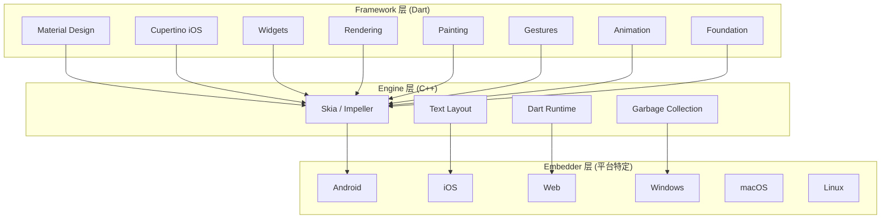
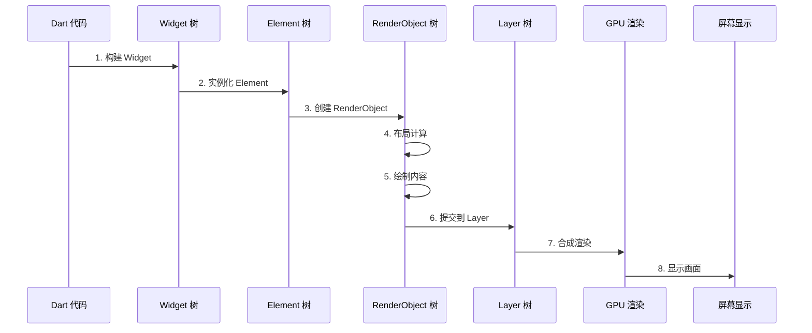
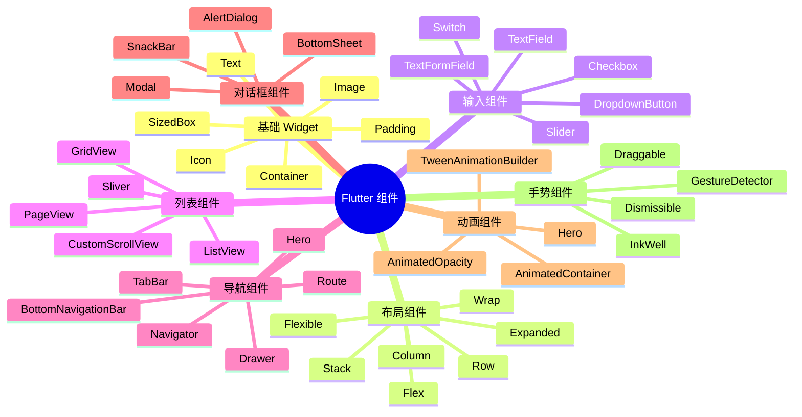
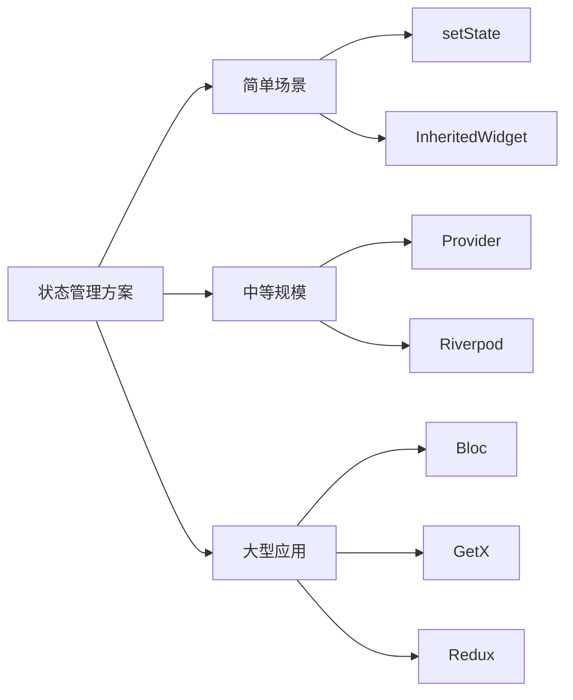

# Flutter 跨平台开发完全指南：从零基础到实战专家

> "一切皆 Widget" —— 这不仅是一句口号，更是 Flutter 革命性设计哲学的完美诠释。在这个移动应用开发百花齐放的时代，Flutter 以其独特的优势正在改变开发者构建应用的思维方式。

## 前言：为什么选择 Flutter？

在 2024 年的移动开发领域，Flutter 已经从一个"新兴技术"成长为"主流选择"。无论是初创公司的 MVP 产品，还是大型企业的核心应用，Flutter 都在证明其价值：

- **一套代码，多端运行**：iOS、Android、Web、Windows、macOS、Linux —— 真正的跨平台
- **原生级性能**：60fps 的流畅体验，媲美原生应用
- **热重载**：毫秒级开发反馈，大幅提升开发效率
- **丰富的组件库**：超过 1000+ 开箱即用的 Material 和 Cupertino 组件
- **强大的生态**：30,000+ 第三方包，覆盖所有常见需求

## 一、Flutter 核心架构：三层设计的艺术

Flutter 采用了独特的分层架构，这种设计让它既能保持高性能，又能提供良好的开发体验。

### 架构全景图



### 1. Framework 层（开发者直接接触）

这是开发者使用的主要层级，完全用 Dart 语言编写。主要包含：

- **Widgets 层**：提供丰富的 UI 组件库
- **Rendering 层**：负责布局和绘制的核心逻辑
- **Gestures 层**：手势识别和事件处理
- **Animation 层**：动画系统和过渡效果
- **Foundation 层**：基础工具类和核心功能

### 2. Engine 层（性能的引擎）

这是 Flutter 的心脏，用 C++ 编写：

- **Skia / Impeller**：图形渲染引擎，确保跨平台一致性
- **Dart Runtime**：Dart 语言的运行时环境
- **Text Layout**：文本渲染和排版
- **Garbage Collection**：自动内存管理

### 3. Embedder 层（平台桥梁）

负责与底层操作系统交互：

- 处理平台特定的窗口和事件循环
- 管理应用生命周期
- 提供平台原生功能访问

## 二、渲染机制：四棵树的奥秘

Flutter 的渲染机制是其高性能的核心秘密。理解"四棵树"的协作关系，是掌握 Flutter 性能优化的关键。

### 渲染流程图



### 1. Widget 树：配置描述

Widget 是轻量级的、不可变的配置对象。它们描述了"应该是什么"，而不是"如何做"。

**特点**：
- 不可变性：一旦创建就不能修改
- 轻量级：重建开销极小
- 描述性：只包含配置信息

```dart
class MyWidget extends StatelessWidget {
  @override
  Widget build(BuildContext context) {
    return Container(
      color: Colors.blue,
      child: Text('Hello Flutter'),
    );
  }
}
```

### 2. Element 树：生命周期管理

Element 是 Widget 的实例化版本，负责管理 Widget 的生命周期和状态。

**职责**：
- 管理父子关系
- 保持 State 对象
- 对比新旧 Widget
- 决定是否需要更新

### 3. RenderObject 树：实际渲染

RenderObject 执行实际的布局和绘制操作。

**核心职责**：
- **布局**：根据约束计算尺寸和位置
- **绘制**：在画布上绘制内容
- **命中测试**：响应用户交互

### 4. Layer 树：性能优化

Layer 树用于合成和优化渲染性能。

**优势**：
- 减少重绘范围
- 硬件加速
- 缓存优化

## 三、Dart 语言：Flutter 的基石

Dart 3.6+ 为 Flutter 带来了许多现代化特性，让代码更加简洁和类型安全。

### 核心特性

#### 1. Records（记录类型）

```dart
// 定义 Record
(String, int) userInfo = ('Alice', 25);

// 命名 Record
({String name, int age}) user = (name: 'Bob', age: 30);

// 使用
print(user.name);  // Bob
```

#### 2. Patterns 和 Switch 表达式

```dart
String describe(int value) {
  return switch (value) {
    0 => '零',
    1 => '一',
    _ => '其他',
  };
}

// Pattern 匹配
String checkUser(Object obj) {
  return switch (obj) {
    String s when s.isEmpty => '空字符串',
    String s => '字符串: $s',
    int i when i > 0 => '正整数',
    _ => '其他类型',
  };
}
```

#### 3. 异步编程

```dart
// async/await
Future<String> fetchData() async {
  await Future.delayed(Duration(seconds: 1));
  return 'Data loaded';
}

// Stream
Stream<int> numberStream() async* {
  for (int i = 0; i < 5; i++) {
    yield i;
  }
}
```

## 四、组件系统：构建 UI 的积木

Flutter 提供了丰富的组件库，分为多个类别。理解这些组件的特点和使用场景，是快速开发的基础。

### 组件分类体系



### 1. 布局组件详解

#### Container：万能容器

```dart
Container(
  width: 200,
  height: 200,
  padding: EdgeInsets.all(16),
  margin: EdgeInsets.symmetric(horizontal: 10),
  decoration: BoxDecoration(
    color: Colors.blue,
    borderRadius: BorderRadius.circular(12),
    boxShadow: [
      BoxShadow(
        color: Colors.black.withOpacity(0.2),
        blurRadius: 10,
      ),
    ],
  ),
  child: Text('Container'),
)
```

#### Row / Column：线性布局

```dart
Row(
  children: [
    Expanded(child: Container(color: Colors.red)),
    Expanded(
      flex: 2,
      child: Container(color: Colors.green),
    ),
  ],
)

Column(
  mainAxisAlignment: MainAxisAlignment.center,
  crossAxisAlignment: CrossAxisAlignment.stretch,
  children: [
    Text('Item 1'),
    Text('Item 2'),
  ],
)
```

#### Stack：堆叠布局

```dart
Stack(
  children: [
    Container(color: Colors.blue),
    Positioned(
      top: 20,
      left: 20,
      child: Container(
        width: 100,
        height: 100,
        color: Colors.red,
      ),
    ),
  ],
)
```

### 2. 列表组件

#### ListView：可滚动列表

```dart
// 简单列表
ListView(
  children: [
    ListTile(title: Text('Item 1')),
    ListTile(title: Text('Item 2')),
  ],
)

// 性能优化 - 使用 builder
ListView.builder(
  itemCount: 1000,
  itemBuilder: (context, index) {
    return ListTile(title: Text('Item $index'));
  },
)
```

#### GridView：网格布局

```dart
GridView.count(
  crossAxisCount: 2,
  children: List.generate(20, (index) {
    return Container(
      color: Colors.primaries[index % Colors.primaries.length],
    );
  }),
)
```

### 3. 输入组件

```dart
TextField(
  decoration: InputDecoration(
    labelText: '用户名',
    hintText: '请输入用户名',
    prefixIcon: Icon(Icons.person),
    border: OutlineInputBorder(),
  ),
  onChanged: (value) {
    print(value);
  },
)

ElevatedButton(
  onPressed: () {
    print('按钮点击');
  },
  child: Text('提交'),
)
```

## 五、状态管理：Flutter 的灵魂

状态管理是 Flutter 开发中最重要的话题之一。选择合适的状态管理方案，直接影响应用的可维护性和性能。

### 状态管理方案对比



### 1. Provider：推荐首选

```dart
// 创建 Provider
class CounterProvider extends ChangeNotifier {
  int _count = 0;
  int get count => _count;
  
  void increment() {
    _count++;
    notifyListeners();
  }
}

// 在应用中提供
void main() {
  runApp(
    ChangeNotifierProvider(
      create: (context) => CounterProvider(),
      child: MyApp(),
    ),
  );
}

// 在组件中使用
class MyWidget extends StatelessWidget {
  @override
  Widget build(BuildContext context) {
    final counter = Provider.of<CounterProvider>(context);
    
    return Text('计数: ${counter.count}');
  }
}
```

### 2. Bloc：大型应用选择

```dart
// 定义事件
abstract class CounterEvent {}

class CounterIncrementPressed extends CounterEvent {}

// 定义状态
class CounterState {
  final int count;
  CounterState(this.count);
}

// 创建 Bloc
class CounterBloc extends Bloc<CounterEvent, CounterState> {
  CounterBloc() : super(CounterState(0)) {
    on<CounterIncrementPressed>((event, emit) {
      emit(CounterState(state.count + 1));
    });
  }
}

// 使用 BlocBuilder
BlocBuilder<CounterBloc, CounterState>(
  builder: (context, state) {
    return Text('计数: ${state.count}');
  },
)
```

## 六、路由导航：页面跳转的艺术

Flutter 提供了强大的路由系统，支持命名路由、动态路由、路由守卫等高级功能。

### 1. 基础导航

```dart
// 页面跳转
Navigator.push(
  context,
  MaterialPageRoute(builder: (context) => SecondPage()),
);

// 返回上一页
Navigator.pop(context);

// 替换当前页面
Navigator.pushReplacement(
  context,
  MaterialPageRoute(builder: (context) => HomePage()),
);
```

### 2. 命名路由

```dart
MaterialApp(
  routes: {
    '/': (context) => HomePage(),
    '/details': (context) => DetailsPage(),
    '/settings': (context) => SettingsPage(),
  },
)

// 使用命名路由
Navigator.pushNamed(context, '/details');
```

### 3. Hero 动画

```dart
// 页面 A
Hero(
  tag: 'avatar',
  child: CircleAvatar(
    backgroundImage: NetworkImage(url),
  ),
)

// 页面 B
Hero(
  tag: 'avatar',
  child: Image.network(url),
)
```

## 七、最佳实践和性能优化

### 1. 性能优化原则

#### 使用 const 构造函数

```dart
// ✅ 推荐
const Text('Hello');
const Padding(padding: EdgeInsets.all(16));

// ❌ 避免
Text('Hello');
Padding(padding: EdgeInsets.all(16));
```

#### 避免过度重建

```dart
// ✅ 使用 const 提升到父级
Column(
  children: const [
    Text('Static'),
    Text('Content'),
  ],
)

// ❌ 每次都重建
Column(
  children: [
    Text('Static'),
    Text('Content'),
  ],
)
```

#### 使用 RepaintBoundary

```dart
RepaintBoundary(
  child: ComplexWidget(),
)
```

#### 长列表优化

```dart
// ✅ 使用 ListView.builder
ListView.builder(
  itemCount: 10000,
  itemBuilder: (context, index) {
    return ListTile(title: Text('Item $index'));
  },
)

// ❌ 避免使用 ListView
ListView(
  children: List.generate(10000, (index) {
    return ListTile(title: Text('Item $index'));
  }),
)
```

### 2. 代码组织最佳实践

#### 项目结构

```
lib/
├── main.dart
├── models/          # 数据模型
├── widgets/         # 通用组件
├── screens/         # 页面
├── services/        # 业务逻辑
├── providers/       # 状态管理
├── utils/           # 工具类
└── constants/       # 常量
```

#### Widget 命名规范

```dart
// 页面 Widget
class HomePage extends StatelessWidget {}

// 功能 Widget
class CustomButton extends StatelessWidget {}

// 列表项 Widget
class ProductListItem extends StatelessWidget {}
```

### 3. 错误处理

```dart
// 捕获所有错误
void main() {
  FlutterError.onError = (details) {
    FlutterError.dumpErrorToConsole(details);
    // 发送到错误追踪服务
  };
  
  runApp(MyApp());
}

// Future 错误处理
Future<void> fetchData() async {
  try {
    final data = await api.getData();
    return data;
  } on SocketException {
    throw Exception('网络错误');
  } on HttpException {
    throw Exception('服务器错误');
  } catch (e) {
    throw Exception('未知错误: $e');
  }
}
```

## 八、学习路径建议

### 初级阶段（1-2 个月）

1. **Dart 语言基础**
   - 变量和数据类型
   - 函数和类
   - 异步编程
   - 集合操作

2. **Flutter 基础**
   - 开发环境搭建
   - 项目结构
   - Widget 基础
   - 布局组件

3. **第一个应用**
   - 实现一个简单的 Todo 应用
   - 学习状态管理基础
   - 掌握导航跳转

### 中级阶段（2-4 个月）

1. **组件深入**
   - 自定义 Widget
   - 动画系统
   - 手势处理
   - 表单处理

2. **网络和数据**
   - HTTP 请求
   - JSON 解析
   - 本地存储
   - 数据缓存

3. **状态管理**
   - Provider 实战
   - Riverpod 入门
   - 选择合适的方案

### 高级阶段（4-6 个月）

1. **性能优化**
   - 渲染优化
   - 内存管理
   - 应用包体积优化
   - 启动速度优化

2. **高级特性**
   - 平台通道（Platform Channels）
   - 自定义渲染
   - 复杂动画
   - 测试和调试

3. **架构设计**
   - MVC/MVVM 模式
   - 依赖注入
   - 代码模块化
   - 团队协作规范

## 九、生态和资源

### 常用第三方包

```yaml
dependencies:
  # 网络请求
  dio: ^5.0.0
  
  # 状态管理
  provider: ^6.0.0
  flutter_bloc: ^8.0.0
  
  # 本地存储
  shared_preferences: ^2.0.0
  hive: ^2.0.0
  
  # 工具库
  intl: ^0.18.0
  flutter_screenutil: ^5.0.0
  
  # UI 组件
  flutter_svg: ^2.0.0
  cached_network_image: ^3.0.0
```

### 学习资源

- **官方文档**：https://flutter.dev/docs
- **Flutter 中文网**：https://flutter.cn
- **Pub.dev**：https://pub.dev
- **GitHub**：https://github.com/flutter/flutter

## 十、总结和展望

Flutter 正在快速发展，以下是一些值得关注的新特性：

1. **Flutter 3.28+ 新特性**
   - Impeller 渲染引擎全面启用
   - 增强的 WASM 支持
   - 新的动画 API
   - 性能持续优化

2. **Flutter 4.0 展望**
   - 更好的 Web 性能
   - 增强 AI 集成能力
   - 更丰富的组件库
   - 改进的开发工具

3. **未来趋势**
   - AI 辅助开发
   - 低代码/无代码集成
   - 更强的跨平台能力
   - 云端协作开发

## 结语

Flutter 已经从"新兴技术"成长为"主流选择"，它正在改变我们构建移动应用的方式。无论你是初学者还是经验丰富的开发者，Flutter 都值得你投入时间学习和掌握。

**记住**：
- 从小项目开始，逐步积累经验
- 深入理解核心概念，不要只停留在表面
- 多看源码，理解设计思想
- 参与社区，保持学习热情

**开始你的 Flutter 之旅吧！** 🚀

---

*本文档基于 Flutter 3.28+ 版本编写，涵盖从基础到进阶的核心知识点。如有疑问，欢迎交流讨论！*

**作者**：Flutter 教程团队  
**更新日期**：2026年3月  
**版本**：v2.0